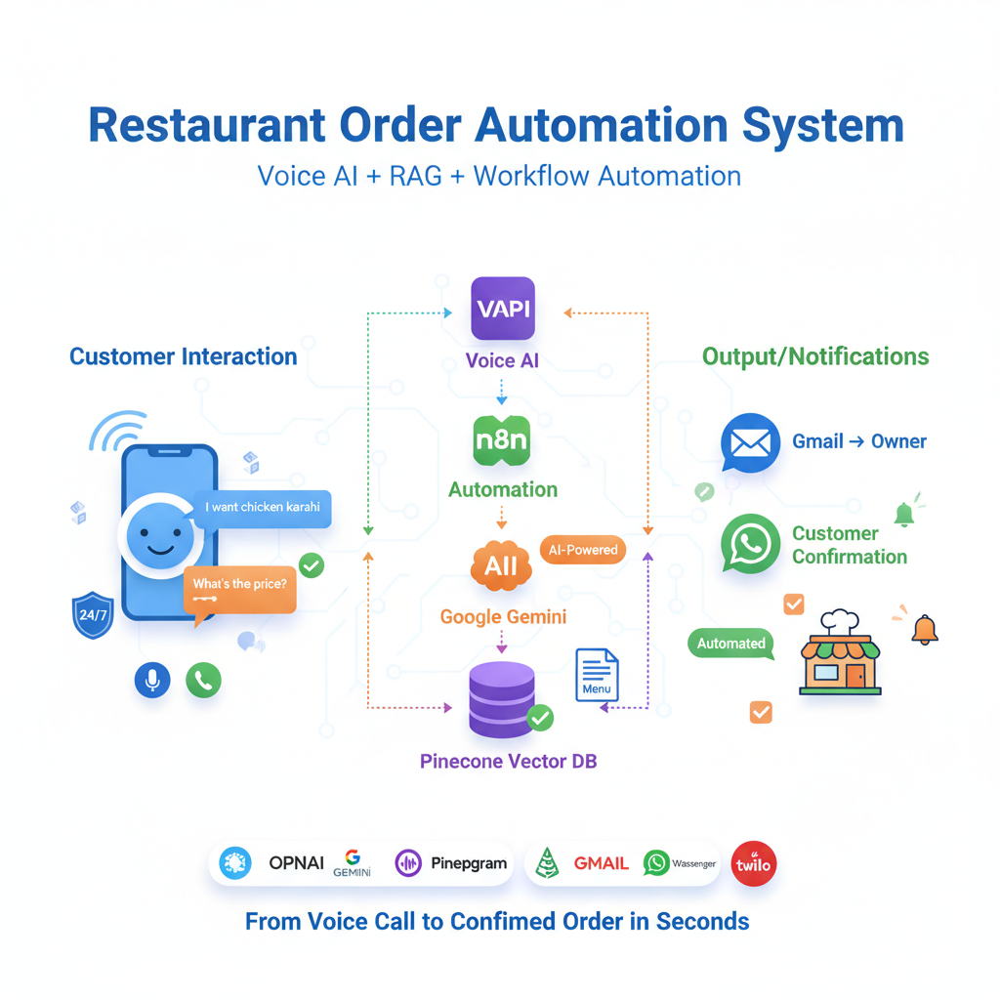

# Restaurant Order Automation System

A complete AI-powered voice ordering system that enables customers to place restaurant orders through natural phone conversations. The system uses voice AI, RAG (Retrieval Augmented Generation), and workflow automation to process orders, validate menu items, and send confirmations.


## 🎯 Project Overview

This project automates the complete restaurant ordering process through an AI voice assistant. Customers can call the restaurant, speak naturally to place orders, get menu information, and receive instant confirmations—all without human intervention.

## ✨ Key Features

### 1. **Natural Voice Conversations**
- AI-powered voice assistant greets customers and collects order details
- Natural language processing for understanding customer requests
- Multi-turn conversations with context retention
- Polite error handling and order corrections

### 2. **Intelligent Menu System (RAG)**
- Real-time menu information retrieval from PDF documents
- Dynamic pricing and availability checks
- Answers customer questions about ingredients, prices, and options
- Vector-based semantic search for accurate responses

### 3. **Complete Order Processing**
- Automatic collection of:
  - Customer full name
  - Contact number (with verification)
  - Order items with quantities
  - Special instructions
  - Home address (when needed)
- Order validation against menu database
- Total price calculation

### 4. **Multi-Channel Notifications**
- Email notifications to restaurant owner with order details
- WhatsApp confirmation messages to customers
- Structured HTML email templates with order summary

### 5. **Smart Response Classification**
- AI-powered text classification to route responses
- Determines when to notify owner vs. confirm with customer
- Intelligent message filtering

## 🏗️ System Architecture

```
┌─────────────────────────────────────────────────────────────────┐
│                         CUSTOMER                                 │
│                     (Phone/Web Call)                             │
└────────────────────────┬────────────────────────────────────────┘
                         │
                         ▼
┌─────────────────────────────────────────────────────────────────┐
│                      VAPI AI AGENT                               │
│  • Voice Recognition (Deepgram Nova-2)                           │
│  • Natural Language Understanding (GPT-4o)                       │
│  • Text-to-Speech (OpenAI TTS-1)                                 │
└────────────────────────┬────────────────────────────────────────┘
                         │
                         ▼
┌─────────────────────────────────────────────────────────────────┐
│                     N8N WORKFLOW ENGINE                          │
│                                                                   │
│  ┌─────────────────────────────────────────────────────────┐   │
│  │  1. WEBHOOK RECEIVER                                     │   │
│  │     Receives order data from VAPI                        │   │
│  └─────────────────────────────────────────────────────────┘   │
│                         │                                        │
│                         ▼                                        │
│  ┌─────────────────────────────────────────────────────────┐   │
│  │  2. AI AGENT (Google Gemini)                            │   │
│  │     • Validates order details                            │   │
│  │     • Queries menu via RAG                              │   │
│  │     • Generates confirmation message                     │   │
│  └─────────────────────────────────────────────────────────┘   │
│                         │                                        │
│                         ▼                                        │
│  ┌─────────────────────────────────────────────────────────┐   │
│  │  3. PINECONE VECTOR STORE                               │   │
│  │     • Stores menu embeddings                            │   │
│  │     • Semantic search for menu items                     │   │
│  │     • Returns relevant pricing/info                      │   │
│  └─────────────────────────────────────────────────────────┘   │
│                         │                                        │
│                         ▼                                        │
│  ┌─────────────────────────────────────────────────────────┐   │
│  │  4. TEXT CLASSIFIERS (Google Gemini)                    │   │
│  │     • Classify response intent                           │   │
│  │     • Route to appropriate notification                  │   │
│  └─────────────────────────────────────────────────────────┘   │
│                         │                                        │
│           ┌─────────────┴──────────────┐                        │
│           ▼                            ▼                        │
│  ┌─────────────────┐         ┌─────────────────┐              │
│  │  GMAIL          │         │  WASSENGER      │              │
│  │  (Owner Email)  │         │  (WhatsApp)     │              │
│  └─────────────────┘         └─────────────────┘              │
└─────────────────────────────────────────────────────────────────┘
```

## 🛠️ Technologies & Tools

### Core Platforms

| Technology | Purpose | Link |
|------------|---------|------|
| **[VAPI](https://vapi.ai)** | Voice AI platform for handling phone calls and voice interactions | [docs.vapi.ai](https://docs.vapi.ai) |
| **[n8n](https://n8n.io)** | Workflow automation platform for orchestrating the entire process | [n8n.io](https://n8n.io) |
| **[Twilio](https://twilio.com)** | (Integrated via VAPI) Phone number provisioning and call routing | [twilio.com](https://twilio.com) |

### AI & ML Services

| Service | Purpose | Link |
|---------|---------|------|
| **[OpenAI GPT-4o](https://openai.com)** | Primary language model for conversation handling | [platform.openai.com](https://platform.openai.com) |
| **[OpenAI TTS-1](https://openai.com)** | Text-to-speech for voice responses (Alloy voice) | [platform.openai.com/docs/guides/text-to-speech](https://platform.openai.com/docs/guides/text-to-speech) |
| **[Google Gemini](https://deepmind.google/technologies/gemini/)** | Text classification and order validation | [ai.google.dev](https://ai.google.dev) |
| **[OpenAI Embeddings](https://openai.com)** | Converting menu text to vectors for RAG | [platform.openai.com/docs/guides/embeddings](https://platform.openai.com/docs/guides/embeddings) |
| **[Deepgram Nova-2](https://deepgram.com)** | Speech-to-text transcription | [deepgram.com](https://deepgram.com) |

### Data & Storage

| Service | Purpose | Link |
|---------|---------|------|
| **[Pinecone](https://pinecone.io)** | Vector database for menu embeddings and semantic search | [pinecone.io](https://pinecone.io) |
| **[Google Drive](https://drive.google.com)** | Menu PDF storage and retrieval | [drive.google.com](https://drive.google.com) |

### Communication

| Service | Purpose | Link |
|---------|---------|------|
| **[Gmail API](https://developers.google.com/gmail)** | Sending order confirmation emails to restaurant owner | [developers.google.com/gmail](https://developers.google.com/gmail) |
| **[Wassenger](https://wassenger.com)** | WhatsApp Business API integration for customer confirmations | [wassenger.com](https://wassenger.com) |

## 📋 Workflow Components

### 1. **Webhook Receiver**
- **Node**: n8n Webhook
- **Method**: POST
- **Purpose**: Receives order data and conversation context from VAPI
- **Payload**: Customer details, order items, call metadata

### 2. **Menu Data Ingestion Pipeline**

```
Manual Trigger
    ↓
Google Drive Download (PDF Menu)
    ↓
Default Data Loader (Binary Processing)
    ↓
Recursive Character Text Splitter
    ↓
OpenAI Embeddings Generation
    ↓
Pinecone Vector Store (Insert Mode)
```

**Purpose**: Converts restaurant menu PDF into searchable vector embeddings

### 3. **AI Agent Processing**
- **Model**: Google Gemini
- **Inputs**: Customer order data, conversation history
- **Vector Store**: Pinecone (Retrieve Mode)
- **Functions**:
  - Validates order items against menu
  - Calculates total prices
  - Generates confirmation messages
  - Handles menu queries

### 4. **Response Classification**
Two parallel text classifiers determine notification routing:

**Classifier 1** (Owner Notification):
- Analyzes if response requires owner notification
- Routes to Gmail node for detailed order emails

**Classifier 2** (Customer Confirmation):
- Identifies customer-facing confirmations
- Routes to WhatsApp via Wassenger

### 5. **Notification Dispatch**

**Email to Owner** (Gmail):
- Beautiful HTML template
- Complete order details
- Customer contact information
- Special instructions
- Accept order CTA button

**WhatsApp to Customer** (Wassenger):
- Confirmation message
- Order summary
- Expected next steps

## 🔧 Setup Instructions

### Prerequisites
- n8n instance (cloud or self-hosted)
- VAPI account
- OpenAI API key
- Google Cloud project (for Gemini & Drive)
- Pinecone account
- Gmail account with API access
- Wassenger account

### Step 1: Configure API Credentials in n8n

```yaml
Required Credentials:
  - Google Palm API (for Gemini)
  - OpenAI API
  - Pinecone API
  - Google Drive OAuth2
  - Gmail OAuth2
  - Wassenger API Token
```

### Step 2: Create Pinecone Index

```bash
Index Name: resturant-orders-automation
Namespace: resturant-orders-auto
Dimensions: 1536 (OpenAI embedding size)
Metric: cosine
```

### Step 3: Upload Menu PDF to Google Drive
- Upload your restaurant menu PDF
- Note the File ID from the share link
- Update the "Download file" node in n8n

### Step 4: Configure VAPI Assistant

```json
{
  "model": "gpt-4o",
  "voice": {
    "provider": "openai",
    "voiceId": "alloy"
  },
  "transcriber": {
    "provider": "deepgram",
    "model": "nova-2",
    "language": "en"
  },
  "firstMessage": "Hi, Assalam-u-Alaikum! Thanks for calling...",
  "tools": [
    {
      "type": "function",
      "function": {
        "name": "get_customer_data",
        "description": "Collect order information",
        "parameters": { /* order fields */ }
      },
      "server": {
        "url": "https://your-n8n-instance.com/webhook/...",
        "method": "POST"
      }
    }
  ]
}
```

### Step 5: Import n8n Workflow
1. Copy the JSON workflow provided
2. Import into n8n
3. Update credential placeholders
4. Activate the workflow

### Step 6: Ingest Menu Data
1. Execute the "When clicking 'Execute workflow'" trigger
2. Wait for vector embeddings to be created
3. Verify data in Pinecone dashboard

## 📊 Data Flow

### Incoming Call Flow

```
1. Customer calls → VAPI answers
2. VAPI AI collects: name, number, order items
3. For menu questions → VAPI calls read_menu tool
4. n8n webhook receives question → AI Agent queries Pinecone
5. Relevant menu info returned → VAPI speaks to customer
6. Order complete → VAPI calls get_customer_data tool
7. n8n webhook receives full order data
8. AI Agent validates and formats order
9. Text classifiers route notifications
10. Email sent to owner + WhatsApp to customer
11. Response returned to VAPI
12. VAPI confirms order and ends call
```

## 🎯 Use Cases

1. **24/7 Order Taking**: No need for staff to answer phones
2. **Menu Inquiries**: Instant answers about prices, ingredients
3. **Order Validation**: Prevents invalid orders before processing
4. **Multi-language Support**: Easily extendable to other languages
5. **Order History**: All conversations logged in VAPI dashboard
6. **Scalability**: Handle multiple simultaneous calls

## 🔐 Security Considerations

- API keys stored securely in n8n credentials
- Webhook endpoints use unique UUIDs
- Customer data transmitted over HTTPS
- No sensitive data stored in logs
- OAuth2 for Google services

## 🚀 Future Enhancements

- [ ] Payment processing integration
- [ ] Order tracking system
- [ ] Customer order history
- [ ] Multi-restaurant support
- [ ] Real-time inventory checking
- [ ] Loyalty program integration
- [ ] SMS notifications
- [ ] Analytics dashboard

## 📝 Configuration Variables

```javascript
// Update these in your n8n workflow
{{GOOGLE_PALM_API_ID}}      // Google Gemini credentials
{{OPENAI_API_ID}}            // OpenAI credentials
{{PINECONE_API_ID}}          // Pinecone credentials
{{GOOGLE_DRIVE_OAUTH2_ID}}   // Google Drive credentials
{{GMAIL_OAUTH2_ID}}          // Gmail credentials
{{WASSENGER_TOKEN}}          // Wassenger API token
```

## 🐛 Troubleshooting

### Issue: Menu queries returning "not found"
**Solution**: Re-run the menu ingestion workflow to refresh vector embeddings

### Issue: Emails not sending
**Solution**: Verify Gmail OAuth2 permissions include "send" scope

### Issue: WhatsApp messages failing
**Solution**: Check Wassenger phone number format (must include country code)

### Issue: VAPI calls timing out
**Solution**: Optimize AI Agent response time by reducing system message length

## 📄 License

This project is created for educational and commercial use. Modify as needed for your restaurant.

## 🤝 Contributing

Contributions are welcome! Feel free to:
- Report bugs
- Suggest features
- Submit pull requests
- Improve documentation

## 📧 Support

For questions or issues, please contact : pforprogrammer9@gmail.com

---

**Built with ❤️ using AI-powered automation**
